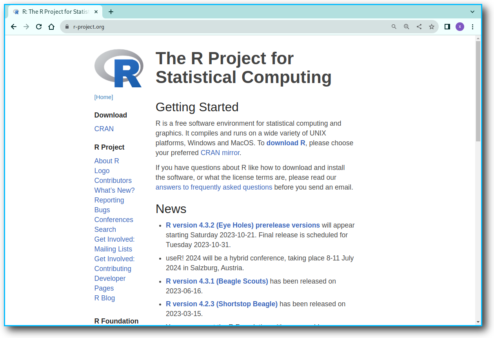

# Rのインストール

Ｒ言語は、統計計算やグラフを得意とするプログラミング言語です。

ここでは、R言語の基本システムをWindowsにインストールする方法を紹介します。


## The R Project for Statistical Computing

R言語(GNU R)については、その開発を行っている「[The R Project for Statistical Computing](https://www.r-project.org/)」のページで情報が発信されています。
このWebページでは、Ｒに関する基本的な情報の他、最新のリリース情報を得たり、マニュアルの閲覧が出来ます。


```{r rtoppage001, echo=FALSE, out.width="100%"}

```

[https://www.r-project.org/](https://www.r-project.org/)


## CRAN

Rに関するリソース（インストールプログラムやパッケージ等の配布物）はCRAN(the Comprehensive R Archive Network)で管理されています。
つまりは、Rに関して何かダウンロードしたい場合に訪れる場所がCRANです。
CRANは、「シーラン」または「クラン」と発音します。

このCRANは、世界中にミラーサイト（同じ内容のサイト）が存在し、
ネットワーク的に近いところからダウンロードが出来るようになっています。
The R Project for Statistical Computingのページの左側メニューの一番上のCRANと書かれたリンクから世界各国にあるミラーサイトの紹介ページへ行くことが出来ます。
その中には、日本国内のCRANミラーサイトとして次のものが紹介されています。

- [https://cran.ism.ac.jp/](https://cran.ism.ac.jp/)
- [http://cran.ism.ac.jp/](http://cran.ism.ac.jp/)
- [https://ftp.yz.yamagata-u.ac.jp/pub/cran/](https://ftp.yz.yamagata-u.ac.jp/pub/cran/)

Rのインストールに必要なファイル等をダウンロードするために、
早速、上記のいずれかのCRANにアクセスしましょう。

## セットアップファイルのダウンロード

CRANにアクセスしたら、Download and Install Rという項目にある**Download R for Windows**と書かれたリンクをクリックして、Windows用のページに行きます。

```{r cran001, echo=FALSE, out.width="100%"}
knitr::include_graphics("images/ri/cran001.png")
```

R for Windowsと書かれたWindows用のページに切り替わるので、
baseと書かれた項目の右側の文書の中にある、**install R for the first time**と書かれたリンクをクリックします。

```{r cran002, echo=FALSE, out.width="100%"}

```

そうすると、Windows用のセットアップファイルがダウンロード出来るページに切り替わります。

```{r cran003, echo=FALSE, out.width="100%"}

```

2019/05/30時点では、スクリーンショットの通り、
ページのタイトルが **R-3.6.0 for Windows (32/64 bit)**となっていますが、
数字の部分は、そのバージョン番号を表しており、最新のものほど大きな数字になっていきます。
つまり、あなたが目にする数字は、時期により異なり「3.6.1」だったり、「3.7.0」だったりするかもしれません。
しかし、そのページでは、その時に表示されているものが最新のバージョンなので、それをそのままインストールして構いません。（バージョン等変化する部分があるとき、3.x.x等とxを使って表記されることがあります。）


ここで、**Download R 3.6.0 for Windows**
と書かれたリンクをクリックして、
インストール用のセットアッププログラムのファイルをダウンロードし保存します。

ここで、インストール用のセットアッププログラムファイルは、通常、ダウンロードフォルダにダウンロードされますが、
良く分からない場合には、**Download R 3.6.0 for Windows**
と書かれたリンクを右クリックして出てくるメニューの
「名前を付けてリンク先を保存」を選択することで、
自分の好きな場所、例えば、デスクトップ等にダウンロードすることもできます。

ダウンロードされるファイルの名前は、**R-3.6.0-win.exe**です。
数字の部分は、バージョンを表しているので、その時によって変化します。


## インストール

```{r setupfile001, echo=FALSE, out.width="100%"}

```

ダウンロードしたセットアップファイル**R-3.x.x-win.exe**をダブルクリックします。

Windwosのデバイスに変更を加える注意のダイアログに答えると、
セットアップに使用する言語の選択ダイアログが出るので
「日本語」になっていることを確認して「OK」します。


### ライセンスへの同意

```{r rsetup001, echo=FALSE, out.width="100%"}

```

ライセンス条項を読んで「次へ」をクリック

### インストール先の指定

```{r rsetup002, echo=FALSE, out.width="100%"}
knitr::include_graphics("images/ri/rsetup002.png")
```

既に適切な場所が入力されているはずなので、そのまま「次へ」をクリック


### コンポーネントの選択

```{r rsetup003, echo=FALSE, out.width="100%"}
knitr::include_graphics("images/ri/rsetup003.png")
```

そのままの状態で「次へ」をクリック


### 起動時オプション

```{r rsetup004, echo=FALSE, out.width="100%"}

```
そのままの状態で「次へ」をクリック


### プログラムグループの指定

```{r rsetup005, echo=FALSE, out.width="100%"}
knitr::include_graphics("images/ri/rsetup005.png")
```

そのままの状態で「次へ」をクリック


### 追加タスクの選択

```{r rsetup006, echo=FALSE, out.width="100%"}

```

そのままの状態で「次へ」をクリック


### インストールがはじまります

```{r rsetup007, echo=FALSE, out.width="100%"}

```
パソコンにファイルが展開されて実際にインストールされます。


### インストールが完了します

```{r rsetup008, echo=FALSE, out.width="100%"}
knitr::include_graphics("images/ri/rsetup008.png")
```

暫くすると、インストール完了のダイアログがでるので「完了」をクリックして、インストールを完了させましょう。


