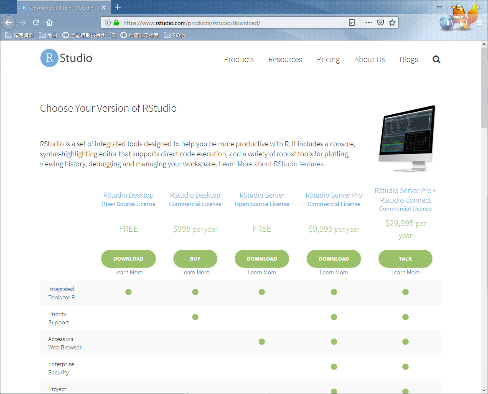
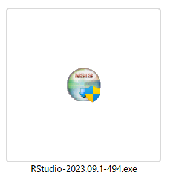
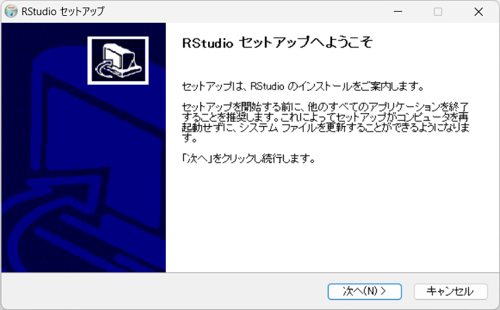
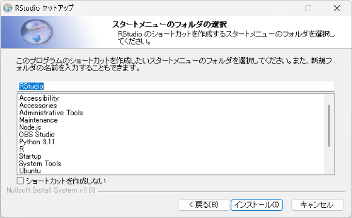
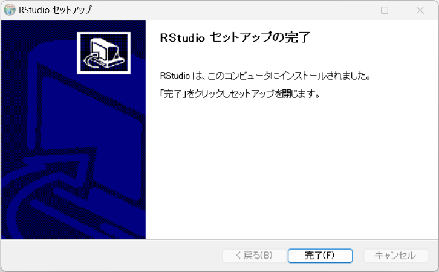

# RStudioのインストール

Rの統合開発環境（IDE）であるRStudioのインストールを紹介します。

## RStudio

[RStudio](https://www.rstudio.com/)のWebページでは、
IDEだけでなく
Rで人気のパッケージの開発も行われており、
それらの情報も、このWebページから辿ることが出来ます。

```{r rstudiotop001, echo=FALSE, out.width="80%", fig.cap="https://www.rstudio.com/"}

```


## セットアップファイルのダウンロード

トップページを少し下へスクロールするとRStudioのダウンロードリンクがある（図\@ref(fig:rstudiotop002)）ので、
それをクリックしてダウンロードページへ行きます。

```{r rstudiotop002, echo=FALSE, out.width="80%", fig.cap="ダウンロードページへのリンク"}
knitr::include_graphics("images/rstdi/rstudiotop002.png")
```


切り替わったページ（図\@ref(fig:rstudiodl001)）の初めの方は、RStudioのライセンス形態についての紹介がされているので下の方へスクロールしましょう。

```{r rstudiodl001, echo=FALSE, out.width="80%", fig.cap="ダウンロードページ"}

```

下の方で**Installers for Supported Platforms**という項目がみつかります。

そこに各ＯＳ毎のインストールファイルへのリンクがあります。(図\@ref(fig:rstudiodl002))
Windows用のインストーラーリンクをクリックして、インストーラーを保存しましょう。

```{r rstudiodl002, echo=FALSE, out.width="80%", fig.cap="Windows用インストーラーのダウンロード"}
knitr::include_graphics("images/rstdi/rstudiodl002.png")
```


## インストール


ダウンロードされたセットアップファイル「RStudio-1.2.1335.exe」をダブルクリックします。
（ファイル名の数字はバージョンで時期により異なります）

```{r rstudiosetupfile, echo=FALSE, fig.width=1}

```

Windwosのデバイスに変更を加える注意のダイアログに答えると、セットアップが始まります。

### セットアップのスタート

「次へ」をクリックします（図\@ref(fig:rstudiosetup001)）

```{r rstudiosetup001, echo=FALSE, out.width="70%", fig.cap="install dialog"}

```


### インストール先の指定

既に適当な場所が入力されているはずなので、そのまま「次へ」をクリック（図\@ref(fig:rstudiosetup002)）

```{r rstudiosetup002, echo=FALSE, out.width="70%", fig.cap="install dialog: インストール先"}
knitr::include_graphics("images/rstdi/rstudiosetup002.png")
```


### スタートメニューフォルダの選択

そのままの状態で「インストール」をクリック（図\@ref(fig:rstudiosetup003)）

```{r rstudiosetup003, echo=FALSE, out.width="70%", fig.cap="install dialog:スタートメニュー設定"}

```


### インストールがはじまります。

パソコンにファイルが展開されて実際にインストールされます。（図\@ref(fig:rstudiosetup004)）

```{r rstudiosetup004, echo=FALSE, out.width="70%", fig.cap="install dialog: installing"}
knitr::include_graphics("images/rstdi/rstudiosetup004.png")
```


### インストールが完了します。

暫くすると、インストール完了のダイアログがでるので「完了」をクリックして、インストールを完了させましょう。（図\@ref(fig:rstudiosetup005)）

```{r rstudiosetup005, echo=FALSE, out.width="70%", fig.cap="install dialog: 完了"}

```


