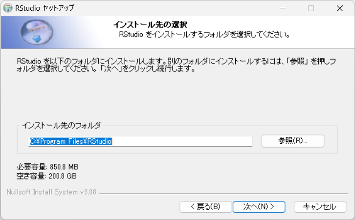

# RStudioのインストール

Rの統合開発環境（IDE）であるRStudioのインストールを紹介します。

## RStudio

RStudioというIDEは、もともと、RStudioという会社で作られていて、
Webページの名称もRStudioでした。
しかし、今は社名が「[posit](https://posit.co)」に変更になり、
RStudioと言えば、IDEのことのみを指すようになっています。


さて、[posit](https://posit.co)のWebページでは、
IDEだけでなく
Rで人気のパッケージの開発も行われており、
それらの情報も、このWebページから辿ることが出来ます。

```{r rstudiotop001, echo=FALSE, out.width="80%", fig.cap="https://posit.co"}
knitr::include_graphics("images/rstdi/rstudiotop001.png")
```


## セットアップファイルのダウンロード


まずは、トップページの右上にある「DOWNLOAD RSTUDIO」と書かれたボタンをクリックしましょう。

```{r rstudiotop00101, echo=FALSE, out.width="80%", fig.cap="TOPページのDOWNLOADボタン"}

```


そうすると、RStudio Desktopのダウンロードページになります。

```{r rstudiotop00102, echo=FALSE, out.width="80%", fig.cap="RStudioのDLページ"}
knitr::include_graphics("images/rstdi/rstudiotop001_2.png")
```

このページにある「DOWNLOAD RSTUDIO」ボタンをクリックしましょう。
RStudioには、「デスクトップ」と「サーバー」の２種類がありますが、
このボタンをクリックして「RStudioデスクトップ」のダウンロードページへ行きます。

```{r rstudiotop00103, echo=FALSE, out.width="80%", fig.cap="RStudio DesktopのDLページ"}

```

このページに来たら、少し下へスクロールして、
Windows10/11用のインストーラーファイルがダウンロードできる場所を見つけましょう。


```{r rstudiotop00104, echo=FALSE, out.width="80%", fig.cap="Windowsのインストーラーファイル"}

```


Windows用のインストーラーファイルは「RSTUDIO-20xx.xx.x-xxx.EXE」という風に、
拡張子が **EXE** になっています。ファイル名部分をクリックして
インストーラーファイルをダウンロードしましょう。


## インストール


ダウンロードされたセットアップファイル「RStudio-1.2.1335.exe」をダブルクリックします。
（ファイル名の数字はバージョンで時期により異なります）

```{r rstudiosetupfile, echo=FALSE}

```

Windwosのデバイスに変更を加える注意のダイアログに答えると、セットアップが始まります。

### セットアップのスタート

「次へ」をクリックします（図\@ref(fig:rstudiosetup001)）

```{r rstudiosetup001, echo=FALSE, out.width="70%", fig.cap="install dialog"}
knitr::include_graphics("images/rstdi/rstudiosetup001.png")
```


### インストール先の指定

既に適当な場所が入力されているはずなので、そのまま「次へ」をクリック（図\@ref(fig:rstudiosetup002)）

```{r rstudiosetup002, echo=FALSE, out.width="70%", fig.cap="install dialog: インストール先"}

```


### スタートメニューフォルダの選択

そのままの状態で「インストール」をクリック（図\@ref(fig:rstudiosetup003)）

```{r rstudiosetup003, echo=FALSE, out.width="70%", fig.cap="install dialog:スタートメニュー設定"}
knitr::include_graphics("images/rstdi/rstudiosetup003.png")
```


### インストールがはじまります。

パソコンにファイルが展開されて実際にインストールされます。（図\@ref(fig:rstudiosetup004)）

```{r rstudiosetup004, echo=FALSE, out.width="70%", fig.cap="install dialog: installing"}
knitr::include_graphics("images/rstdi/rstudiosetup004.png")
```


### インストールが完了します。

暫くすると、インストール完了のダイアログがでるので「完了」をクリックして、インストールを完了させましょう。（図\@ref(fig:rstudiosetup005)）

```{r rstudiosetup005, echo=FALSE, out.width="70%", fig.cap="install dialog: 完了"}
knitr::include_graphics("images/rstdi/rstudiosetup005.png")
```


