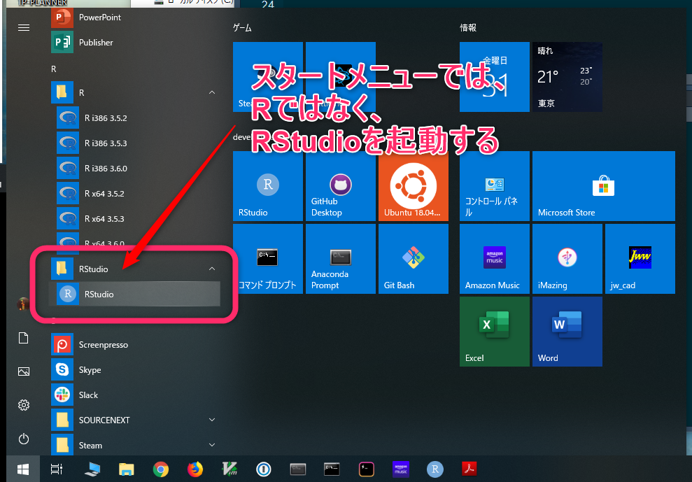

# RStudioでパッケージをインストールする

Rのシステムは**パッケージ**をインストールすることで、
機能を拡張することが出来る仕組みになっています。
このパッケージは、世界各国の現場の研究者達やRStudioチームをはじめとするオープンソース開発者達が独自に開発して公開しています。
また、パッケージには、CRANを通じて公式に配布されているものと、
GitHub等を通じてプログラマが独自に配布しているものとがあります。

ここでは、初めて立ち上げるRStudioについての簡単な紹介と、
そのRStudioを使ったパッケージのインストール方法を紹介します。

尚、基本的にRStudio上でのインストール操作を行うと
RStudioがインターネット経由でCRANからパッケージファイルをダウンロードし、
それをインストールしてくれます。
そこで、以下の手順は、
**インターネットに繋がっている環境で行う必要**があります。


## 初めてのRStudio

これからデータ分析を行うために使っていく事になる
**RStudio**はどんなものなのかを簡単に紹介します。


### RStuidoの起動

ここまでのインストール作業で、**Rのシステム**と**RStudio**の２つをインストールしました。
Windowsのスタートメニューには、RとRStudioの両方を見つけることが出来ます。
しかし、これからあなたはRの作業を常に**RStudio**で行います。
ですから、WindowsスタートメニューのRのフォルダは気にせずに、RStudio（図\@ref(fig:windowsStartMenu)）だけに注目してください。


```{r windowsStartMenu, echo=FALSE, out.width="95%", fig.cap="スタートメニュの中のRStudio"}

```

では、早速、RStudioを起動して下さい。

### RStudioは区画に分かれている

```{r rstudioLook001, echo=FALSE, out.width="90%", fig.cap="RStudio"}
knitr::include_graphics("images/rpi/rstudio_look001.png")
```

RStudioの画面は、いつも、幾つかの区画に分かれています。
（図\@ref(fig:rstudioLook001)）
立ち上げた直後は、左に大きな区画が１つと右に上下に区切られた区画が２つあります。
しかし、作業をしているうちに、だいたい左側も上下２つの区画に分かれるので、
RStudioの見た目は４つの区画に分かれています。
尚、区画の事を**ペイン**（pane:ガラス板とか格子という意味）と
表現されていることもあるので、ペインと聞いたら「ああ、区画の事ね」と把握しましょう。

#### 真っ白なRStudio{-}
さて、ここで、区分どころか、いつまでたってもRStudioの画面が真っ白なままの方がいるかもしれません。（図\@ref(fig:whiteRstudio)）

```{r whiteRstudio, echo=FALSE, out.width="95%", fig.cap="真っ白なRStudio"}
knitr::include_graphics("images/rpi/white_rstudio.png")
```

これは、ホームディレクトリの名前に日本語文字が使われている場合に見られる不具合です。このような不具合が出ている場合は、後述の**RStudioが上手く起動しない時の対策**を試してください。


### 各区画の内容はタブで切り変えられる

RStudioは画面の中にあらゆる機能が凝縮されているため、
小さな部分に重要な機能が沢山潜んでいます。
例えば、各区画をもう少しよく見てみましょう。
この区画の上部をよく見てもらうと、どの区画にも**タブ**が並んでいるのをみつけることが出来るはずです。

まずは、右上の区画の上部に注目です。

```{r tabRightUpper, echo=FALSE, out.width="70%", fig.cap="右上区画のタブ"}
knitr::include_graphics("images/rpi/tab_right_upper.png")
```

続いて、右下の区画の上部に目を移してください。

```{r tabRightLower, echo=FALSE, out.width="70%", fig.cap="右下区画のタブ"}
knitr::include_graphics("images/rpi/tab_right_lower.png")
```

そして、このタブをクリックすることで、
各区画の内容を切り替えることが出来ます。

### RStudioの大まかな配置

初めてみるRStudioは複雑そうに見えますが、
これらかデータ分析を行っていくあなたは、
次第に、この殆ど全ての機能を使いこなすようになります。

まず、各区画の大まかな機能について、把握しましょう。


#### メインの作業場となる左側区画{-}

一番初めに、表示されているのは**Console**タブであり、
コンソールが表示されています。
コンソールは、Rのコマンドを打ち込んで結果を得るための場所であり、
Rでのデータ分析においてメインの作業場になります。

また、この左側の区画も、上下２段に分割されます。
その場合、コンソールは下段になり、
上段は主にプログラムコードの編集等、ファイルの編集区画が開きます。
そして、編集作業では、複数のファイルを開く事が出来、
上段区画のタブで開いている各ファイルを切り替えることが出来ます。（図\@ref(fig:rstudio4pane)）

```{r rstudio4pane, echo=FALSE, out.width="90%", fig.cap="RStudioの左区画"}
knitr::include_graphics("images/rpi/rstudio_4pane.png")
```

#### 変数確認の右上区画{-}

主に、プログラムを実行している際の変数の内容を確認したり（Environmentタブ）、
コンソールに打ち込んだコマンドの履歴を見たり（Historyタブ）します。

#### 色々な情報が混在する右下区画{-}

右下区画には、様々な情報が表示されるので、常にタブを切り替えて使うことになります。
右下区画のタブには通常以下のものがあります。

|タブ名|内容|
|:---|:---|
|Files|ファイル管理|
|Plots|グラフ表示|
|Packages|パッケージ管理|
|Help|マニュアル閲覧|
|Viewer|データ閲覧|


ここまでで、RStudioの基礎として２つの事を把握しました。

1. 各区画にに分かれている事
1. 各区画はタブで内容を切り変えられる事

次は実際に、RStudioの機能に触れてみましょう。

## パッケージのインストール

CRANに登録されているパッケージは、2019/5/31時点で14,307あります。
しかし、RのパッケージはCRANに登録されずにGitHub上のみで
公開されているものもあるので、
世の中にあるRパッケージは上記の数よりもずっと多く存在します。
Rでは、これらの全てのパッケージをインストールしなければならないわけでは無く、
これらのうちから自分の作業に必要なもののみをインストールします。

一般的に、Rで新しいことをはじめようとする場合、
参考書等でほぼ初めに述べられるのが、
その作業に必要となるパッケージのインストールについてです。
また、Rのバージョンアップを行ったり、再インストールを行った場合には、
いつも使っていたパッケージについて、再度インストールする必要が生じます。

以上のことから、R言語を利用する場合、パッケージの管理は必須の作業になります。

ここでは、Rでのデータ分析にほぼ必須のパッケージである**tidyverse**を例に
RStudioでのインストール作業を行っていきます。
パッケージのインストールをはじめとするRStudioでのパッケージ管理作業は、
右下区画のPackagesタブで行います。（図\@ref(fig:rpackageinst002)）


```{r rpackageinst002, echo=FALSE, out.width="70%", fig.cap="右下区画のタブ"}
knitr::include_graphics("images/rpi/rpackage_inst002.png")
```


### Packagesペイン

Packagesペインに切り替えた右下区画には、
既にインストールされているパッケージの一覧が表示されています。
（図\@ref(fig:rpackageinst003)）

```{r rpackageinst003, echo=FALSE, out.width="80%", fig.cap="パッケージペイン"}
knitr::include_graphics("images/rpi/rpackage_inst003.png")
```

青くなっているパッケージ名をクリックすると、
表示がそのパッケージの解説に切り替わります。
この時、良く見ると上部のタブが Help に切り替わっているはずです。
**元に戻りたい時は、慌てず Packages タブをクリック**すれば、
Packagesペインに切り替えることが出来ます。

さて、Packagesペインのタブのすぐ下の部分をよく見てもらうと
**Install**と**Update**という項目が並んでいるのを見つけられるはずです。

```{r rpackageinst004, echo=FALSE, out.width="80%", fig.cap="インストールダイアログ呼び出しボタン"}
knitr::include_graphics("images/rpi/rpackage_inst004.png")
```

この Install と書かれている部分にカーソルを持っていくと、
カーソルが指で指し示すマークに変わるので、クリックしましょう。
画面の中央に、**Install Packages**というタイトルのダイアログが現れます。

### インストール用ダイアログ

このInstall Packages ダイアログの真ん中辺りに
**Packages(separate multiple with space or comma)**と
タイトルが付けられている入力フォームがあります。
（図\@ref(fig:rpackageinst005)）

```{r rpackageinst005, echo=FALSE, out.width="80%", fig.cap="パッケージ名入力フォーム"}
knitr::include_graphics("images/rpi/rpackage_inst005.png")
```

この入力フォームに、インストールしたいパッケージ名を書き込み、
下の Install と書かれているボタンを押すと、
パッケージのインストールが始まります。

ここでは、入力フォームに **tidyverse** と書き込んでみましょう。
入力フォームに tidyverse と書けたら、下の Install ボタンを押してください。
インストール作業が開始されます。


### 左区画のConsoleペインでインストール進捗状況を確認

実は、Rでのパッケージのインストールは、本来、
コンソール上で、パッケージをインストールするためのコマンドを入力して
実行することで行います。
例えば、tidyverse のインストールを行う場合、
コンソールのプロンプトに対して次のようなコマンドを入力して実行します。

```R
install.packages("tidyverse")
```

しかし、RStudioでは、
Packagesペインから先のように Install Packages ダイアログ 上で作業を行うと、
あなたのかわりにRStudioがRのパッケージをインストールするためのコマンドを
コンソール上に書き込み、実行してくれる仕組みになっています。
ですから、
Install Packages ダイアログの Install ボタンを押した後、
左側区画のConsoleペインには
インストールに関する色々な情報が出力がされているはずです。
出力は英語ですが、その主な内容は、
インターネットを通じてパッケージをダウンロードし、
適切な場所にインストールする進捗状況が示されています。

ここでは、１つのパッケージを指定したとしても、
デフォルトでは関連して必要となる他のパッケージも
自動でインストールされますので
インストール作業が完了するまでには少し時間が掛かることもあります。
特に tidyverse を初めてインストールする時には関連パッケージが
何十個もインストールされると共に、大きなファイルの展開などもされるため、
**数分待つ**ことになるかもしれません。

インストール作業が完了したら、
プロンプト（入力待ちをあらわす **>** というマーク）が戻ってくるので、
それまでは、おとなしく待ちましょう。
（図\@ref(fig:rpackageinst006)）

```{r rpackageinst006, echo=FALSE, out.width="80%", fig.cap="インストールの完了を知らせるプロンプト"}
knitr::include_graphics("images/rpi/rpackage_inst006.png")
```


### その他よく使うパッケージのインストール

パッケージインストールの練習として、
一般的によく使われる次のパッケージをインストールしてみましょう。
特に **devtools** は必ず、インストールしてください。

- devtools
- data.table
- sf


既にインストールされているパッケージを重複してインストールしても特に問題はないので、
良く分からない場合は、とりあえず、インストールしてしまって構いません。


## GitHubで公開されているパッケージのインストール

先に少し述べた通り、
Rのパッケージには、**CRAN**(シーラン)と呼ばれるRの公式プログラム配布場所から入手ができるものと、
**GitHub等のCRAN以外**の場所から入手出来るものがあります。

ここで、GitHubとは、世界中のプログラマが沢山のプログラムのソースコードを公開している有名なWebサービスです。
プログラムの開発をサポートするサービスなので、CRANに登録されているRのパッケージも、その開発段階の最新のものはGitHub上にもあったりします。

そこで、Rのパッケージの主な入手先は、
**CRAN** か **GitHub** かの２種類になるのですが、

GitHub上のパッケージは、
先に説明した RStudio の Packageペインからの
インストール機能を使ったインストールが出来ません。
GitHubで公開されているパッケージをインストールするためには、本来的な、
パッケージをインストールするための
**コンソールへのコマンド入力が必要**となります。

そこで、まずは、コマンド入力をしたことがない人のために、
コンソールの基礎的な知識についての紹介を行います。


### コンソールの基礎的知識

まずは、**コンソール**そのものについての紹介をしておきましょう。

通常、Windowsを利用する時に**コンソール**や**コマンド**を使うことは
殆どありません。
何かソフトを立ち上げる時にはアイコンをダブルクリックし、
何かの設定を行う時にはメニューやダイアログを開いて指示に従ったり、
様々な選択肢の中から選択を行う事が殆どです。

しかし、Rを使ったデータ分析を行うためには、
多くの作業をコンソール上でのコマンド入力によって行うことになります。

RStudioの左側区画がコンソールペインであることは紹介しました。
このコンソールには
**プロンプト**と呼ばれる文字入力を受け付ける場所があります。
そして、このプロンプトにコマンド文字列を入力して、
エンターキーを押すことで、Rに命令を実行させることが出来ます。

あらためて、コンソールの実物を見ながら、
最低限覚えておくべき用語の整理をしておきます。

```{r console, echo=FALSE, out.width="90%", fig.cap="コンソールの基本"}
knitr::include_graphics("images/rpi/console001.png")
```

#### コンソール{-}

コンソールはRStuidoの画面の左側にあります。
RStudioを使っている内に左側の画面が上下２分割されることがありますが、
その場合には下側にコンソール画面があります。
また、コンソール画面の上部に小さくConsoleと書かれている部分があるので、
そこを見れば、ここがコンソール画面であることを思い出せます。
これからの作業は、ここにコマンドを入力して行う事になります。

#### プロンプト{-}

コンソール画面左端にある「>」の様な形をしたものをプロンプトと言います。
Rにコマンドを入力する時には、このプロンプトの右側にコマンドを書き込み、
最後にリターンキーを押すことで、そのコマンドを実行することが出来ます。

このプロンプトは、
「コマンドの入力を受け付けています」という意味を持っています。

コマンドを実行して処理をしている最中には、このプロンプトは表示されません。
普段は、あっというまに処理が終わるので、
いつでもプロンプトが表示されているように見えますが、
時間のかかる処理をしている時には、
なかなかプロンプトが表示され無い事もあります。
つまり、コンソールにプロンプトが無い時は、前のコマンドの処理中なので、
次のコマンドを入力するためには、前のコマンドの処理が終わり、
プロンプトが表示されるのを待つ必要があります。

#### カーソル{-}

プロンプトの横に縦棒「|」が、点滅しているかもしれません。
これがカーソルです。
プロンプトへの入力は、リターンキーが押されるまで実行されません。
コンソールからのコマンド入力では、通常、長いコマンドを打ち込む時、
カーソルキーを使ってカーソルを自由に動かし、
行内のあちこちを編集しながら入力して行きます。

まずは、これらの単語を今ここで覚えてしまいましょう。
そうすれば、「解説等でどこの何の話をしているのかがわからない」ということがなくなります。


### devtoolsパッケージが必須

GitHub上のパッケージをインストールするためのコマンドは、
**devtoolsパッケージ**に入っています。
devtoolsパッケージは、CRANに登録されいるパッケージなので、
先の手順でdevtoolsパッケージをインストールしておきましょう。
devtoolsパッケージがインストールされていないと、
GitHubで公開されているパッケージのインストールが出来ません。


### retiパッケージのインストール

筆者が所属する大阪府不動産鑑定士協会不動産取引価格情報活用小委員会では、
国土交通省が公開している不動産取引価格情報のデータを
Rで扱いやすくするためのパッケージとして、
[retiパッケージ](https://github.com/rea-osaka/reti) 
(**R**eal **E**state **T**ransaction-price **I**nfomation data)を
GitHub上で開発して公開しています。

そこで、ここでは、GitHub上のパッケージのインストールの例として、
このretiパッケージのインストールを行います。


GitHub上のパッケージをインストールするためには、
コンソールのプロンプトにコマンドを打ち込んで実行します。
RStudioの左側のコンソールペインにあるプロンプトに、
次のコマンドをキーボードから入力してください。

```R
devtools::install_github("rea-osaka/reti")
```

入力が出来たらEnterキーを押して、入力したコマンドを実行します。


