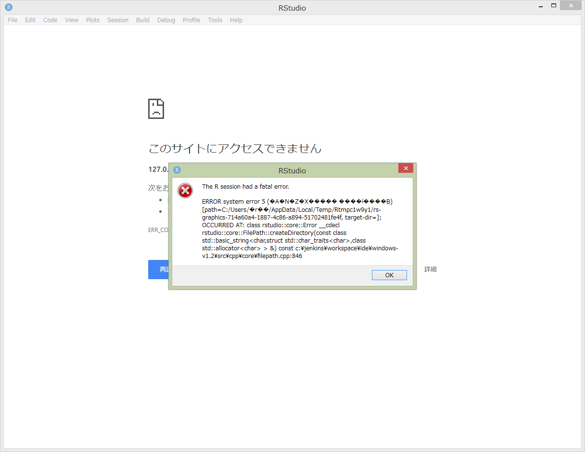
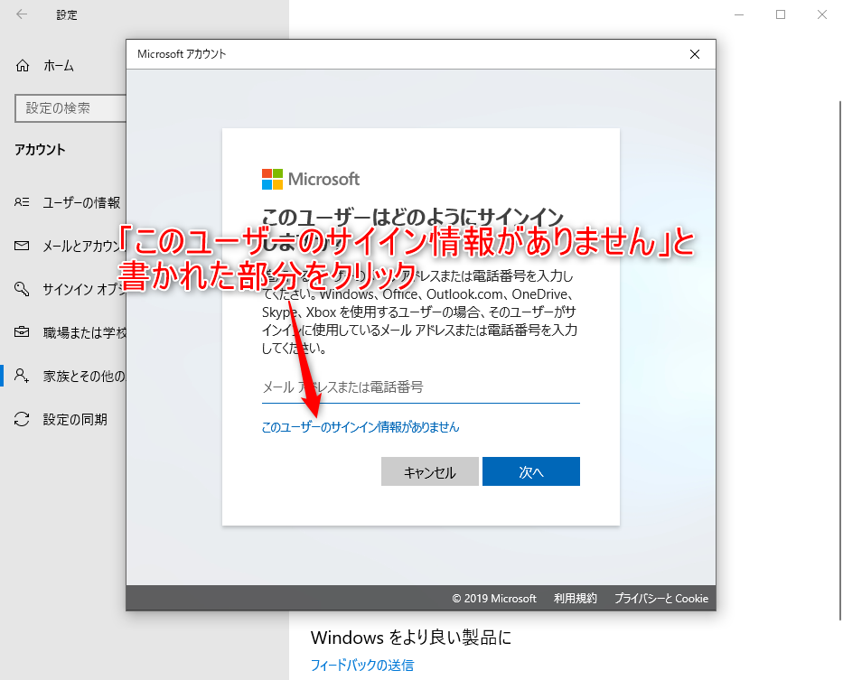
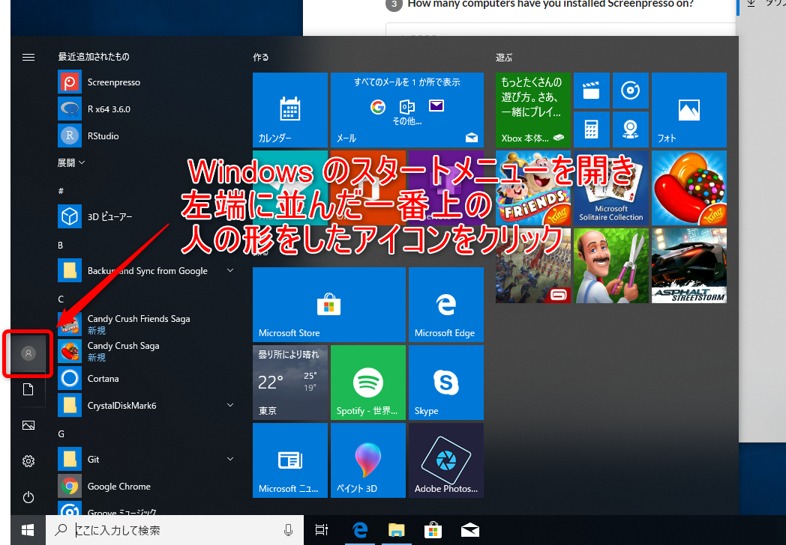

# RStudioが上手く起動しない時の対策 

```{r whiterstudiob, echo=FALSE, out.width="95%", fig.cap="真っ白なRStudio"}
knitr::include_graphics("images/rpi/white_rstudio.png")
```

RStudioを立ち上げた時に、いつまでたっても真っ白なままのWindowで、
上手くRStudioが起動しない場合があります。（図\@ref(fig:whiterstudiob)）

また、図\@ref(fig:errordaialog001)や図\@ref(fig:errordaialog002)ようなダイアログが出て、RStudioが起動しないこともあります。


```{r errordaialog001, echo=FALSE, out.width="70%", fig.cap="Rのエラーダイアログ"}
knitr::include_graphics("images/makeacc/e_dialog001.png")
```


```{r errordaialog002, echo=FALSE, out.width="70%", fig.cap="RStudioのエラーダイアログ"}
knitr::include_graphics("images/makeacc/e_dialog002.png")
```

RStudioにエラーメッセージが表示され、更にエラーダイアログが出て、
図\@ref(fig:errordaialog003)の様になっているかもしれません。

```{r errordaialog003, echo=FALSE, out.width="95%", fig.cap="上手く立ち上がれないRStudio"}

```


このような不具合が起こるケースの原因の一つとして、
ホームディレクトリの名前に日本語文字が使われていることが考えられます。

RStudioが上手く起動しない場合は、まず、
次の手順でホームディレクトリの名前に日本語文字が使われていないかをチェックしましょう。


## ホームディレクトリ名のチェックの方法

Windowsのスタートメニューを開き、
Windowsシステムツールの中にある、**コマンドプロンプト**を立ち上げてください。
（図\@ref(fig:startmenu)）

```{r startmenu, echo=FALSE, out.width="80%", fig.cap="コマンドプロンプトの起動"}
knitr::include_graphics("images/makeacc/cp_start001.png")
```


黒い画面が現れ、

```
C:\Users\shunsk>
```

のような感じの文字が表示されているはずです。
これは、コマンドを受け付けるための**プロンプト**と呼ばれるもので、
チカチカと明滅しているカーソル部分に、キーボードを使ってコマンドを書き込むことが出来ます。

そして、このプロンプトに表示されている文字列が
そのユーザーのホームディレクトリを表しています。

```{r prompt001, echo=FALSE, out.width="85%", fig.cap="アルファベットのみのホームディレクトリ名"}
knitr::include_graphics("images/makeacc/cp_ok.png")
```


### ディレクトリ名が半角英数のみの場合 {-}

図\@ref(fig:prompt001)では、ホームディレクトリ名に半角英数の文字のみが使われています。
このような場合には、特に問題なくRStudioが使える状態です。


### ディレクトリ名に日本語が含まれる場合 {-}

コマンドプロンプトを立ち上げると、
次のように日本語が含まれている場合があります。

```{r prompt002, echo=FALSE, out.width="85%", fig.cap="日本語文字を含むホームディレクトリ名"}
knitr::include_graphics("images/makeacc/cp_bad.png")
```

図\@ref(fig:prompt002)では、
プロンプトに示されるホームディレクトリ名に日本語の文字が含まれています。

```
C:\Users\しゅんすけ>
```

このように、日本語文字がある場合は、
初めのスクリーンショットのようにRStudioが上手く起動しない
不具合が報告されています。

しかし、この場合には、次から述べる対策をすることで、
不具合なくRStudioを使うことが出来るようになります。


## 対策について

ホームディレクトリに日本語名が使われている場合、
お勧めする対策は、新たに別のアカウントを作成することです。

ホームディレクト名は、Windowsのアカウントを作成する際に
アカウント名に応じて自動的に決定されます。
そこで、新しく作成するアカウント名を
アルファベット文字のみからなるアカウント名にすることで、
日本語を含まないホームディレクトリ名を持つ
アカウントを作成することが出来ます。

## 新しいアカウントの作成

ここで、新しいWindowsのアカウントを追加する際に必要な知識として、
Windowsのアカウントには２つの種類があることを紹介しておきます。

### Windowsのアカウントには２つの種類ある

実は、Windowsのアカウントには次の二つの種類があります。

- マイクロソフトアカウントと連携したアカウント
- ユーザーローカルアカウント

マイクロソフトでは、メールサービスや
マイクロソフトのソフト（ワードやエクセル）などを
クラウド管理するのに便利な
マイクロソフトアカウントというサービスを提供しています。
Windowsへのログインもこの
**マイクロソフトアカウントと連携したアカウント**
でログイン出来る様になっています。

一方、別の方法として、マイクロソフトアカウントとは無関係に、
各パソコン上に個別のアカウントを設定して
Windowsにログインすることも出来ます。
このような方法を**ローカルユーザーアカウント**で
ログインする方法と呼ばれています。

ここで、RStudioをインストールするために
新しいアカウントを用意しようとする場合には、
**ユーザーローカルアカウントを用いる方が簡単**であり、
確実にホームディレクトリ名もアルファベットのみのものに出来るので
このローカルユーザーアカウントの方の作成の方法を紹介します。


### ユーザーローカルアカウントの追加

Windows10で、ユーザーローカルアカウントを作成する方法を紹介します。

まず、スタートメニューを開き、歯車マークをクリックして、Windowsの設定ウインドウを開きましょう。
（（図\@ref(fig:makeacc001)））

```{r makeacc001, echo=FALSE, out.width="90%", fig.cap="スタートメニューから設定ウインドウを開く"}
knitr::include_graphics("images/makeacc/make_acc001.png")
```

Windowsの設定ウインドウが開いたら、**アカウント**という項目をクリックします。
（（図\@ref(fig:makeacc002)））

```{r makeacc002, echo=FALSE, out.width="90%", fig.cap="Windowsの設定"}
knitr::include_graphics("images/makeacc/make_acc002.png")
```

アカウントの設定画面に切り替わったら、左側にあるメニューの**家族とその他ユーザー**をクリックします。
（（図\@ref(fig:makeacc003)））

```{r makeacc003, echo=FALSE, out.width="95%", fig.cap="アカウントの設定"}
knitr::include_graphics("images/makeacc/make_acc003.png")
```

家族とその他ユーザーの画面に切り替わったら、他のユーザー項目にある**他のユーザーをこのPCに追加**と書かれている部分をクリックします。
（（図\@ref(fig:makeacc004)））

```{r makeacc004, echo=FALSE, out.width="95%", fig.cap="その他のユーザーの追加"}
knitr::include_graphics("images/makeacc/make_acc004.png")
```

Microsoftアカウントのダイアログが表示され、「このユーザーはどのようにサインインしますか？」と聞かれます。ここでは、**このユーザーのサイン情報がありません**と書かれている部分をクリックします。
（（図\@ref(fig:makeacc005)））

```{r makeacc005, echo=FALSE, out.width="95%", fig.cap="アカウントの作成ダイアログ"}

```

次に「アカウントの作成」項目に切り替わります。
ここでは、**Microsoftアカウントを持たないユーザーを追加する**と書かれている部分をクリックします。
（（図\@ref(fig:makeacc006)））

```{r makeacc006, echo=FALSE, out.width="95%", fig.cap="アカウントを持たないユーザーの追加"}
knitr::include_graphics("images/makeacc/make_acc006.png")
```

「このPC用のアカウントの作成」という項目に切り替わります。
ここで、「このPCを使うのはだれですか？」と聞かれている下のフォームに、
好きなユーザー名を入力します。
ここで入力するユーザー名は、**必ず、アルファベットのみ**の
文字にしてください。（（図\@ref(fig:makeacc007)））
この名前が、ホームディレクトリの名前になります。

```{r makeacc007, echo=FALSE, out.width="95%", fig.cap="アカウントの作成"}
knitr::include_graphics("images/makeacc/make_acc007.png")
```

パスワードを設定する場合は、下側の必要項目を記入の上、次へボタンをクリックします。パスワードが必要なければ、パスワード部分を空欄のままにして次へボタンをクリックします。

以上で、新しいアカウントが作成されます。

Windows8の場合も同様に、**ローカルアカウント**を追加することができます。

PCの設定　> アカウント > その他のアカウント > カウントを追加する > 
Microcoftアカウントを使わずにサインインする > ローカルアカウント

とういう流れで、新しいアカウントが作成できます。
不安な場合には、アカウントの追加について検索エンジンで検索してみたり
周りのパソコンが得意な人にも相談してみましょう。

いずれにせよ、新しく作るアカウント名は、必ず、**アルファベット文字のみのアカウント名**にすることを忘れてはいけません。


### 管理者権限について

管理者権限を持つユーザー（アカウント）のみが、
システムにソフト等をインストールすることが出来ます。

Windowsを買った時に使い始める一番最初のユーザーは
管理者権限をもっていますが、
後から追加したアカウントのユーザーについては、
管理者権限を持たない**標準ユーザー**として作成されます。
しかし、他の管理者権限を持ったユーザーによって、標準ユーザーに
管理者権限を与えることも出来ます。

アカウントの設定の**家族とその他ユーザー**画面には、
今追加した、アカウントのアカウント名が表示されているはずです。
そこをクリックすると、**アカウントの種類の変更**というボタンがあるので、
それを押して現れるダイアログで、**管理者**と**標準ユーザー**を切り替えることが出来ます。

ここで、既にRとRStudioのインストールがおわっているならば、
ここで作成した新しいユーザーに、
管理者権限を持たせる必要はありません。

一方、まだ、RとRStudioをインストールしていなくて、
新しく作成した、アカウントからこれらをインストールする場合には、
この新しいアカウントに管理者権限を持たせてください。

Windows10の場合、マイクロソフトのWindowsのサポートページを参考にしてみてください。

[Windows 10 でローカルのユーザー アカウントまたは管理者アカウントを作成する](https://support.microsoft.com/ja-jp/help/4026923/windows-10-create-a-local-user-or-administrator-account)


## アカウントの切り替え

アカウントが出来たら、アカウントを切り替えてみましょう。

### ログイン画面での切り替え

まず、Windowsを立ち上げたときのログイン画面をみてみましょう。


```{r changeacc, echo=FALSE, out.width="95%", fig.cap="ログイン画面でのアカウントの選択"}
knitr::include_graphics("images/makeacc/login001.JPG")
```

複数アカウントが登録されていると、起動時のWindowsログイン画面の左下に
アカウントのリストが表示されます。（（図\@ref(fig:changeacc)））
ここで、好きなアカウントを選択すれば、そのアカウントでログインできます。

### スタートボタンからの切り替え

右下のWindowsボタンを押し、スタートメニューを開きます。

```{r startmenu001, echo=FALSE, out.width="90%", fig.cap="スタートメニューのアカウント管理アイコン"}

```

スタートメニューの左端に縦にアイコンが並んでおり、
その一番上に、ヒト型のアイコンが見つかるので、
そこをクリックしてください。（（図\@ref(fig:startmenu001)））
アカウントに写真を登録してある場合、
ヒト型アイコンの代わりその写真が表示されている場合もあります。

アイコンをクリックすると、
アカウントを切り替えるためのメニューが表示されます。

```{r startmenu002, echo=FALSE, out.width="90%", fig.cap="アカウントの選択"}
knitr::include_graphics("images/makeacc/startmenu002.png")
```

下側にアカウントの一覧が表示されるので、
切り替えたいアカウントをクリックします。（（図\@ref(fig:startmenu002)））

Windowsには、複数のアカウントで同時にログインできます。
アカウントを切り替えた場合、
元のアカウントも隠れた状態でログインした状態になっており、
再度、元のアカウントに切り替えて戻ってくると、
切り替え前の作業状態がそのまま残っているので
作業の続きが出来ます。

個々のアカウントの終了は、
切り替えメニューにある**サインアウト**でできます。


